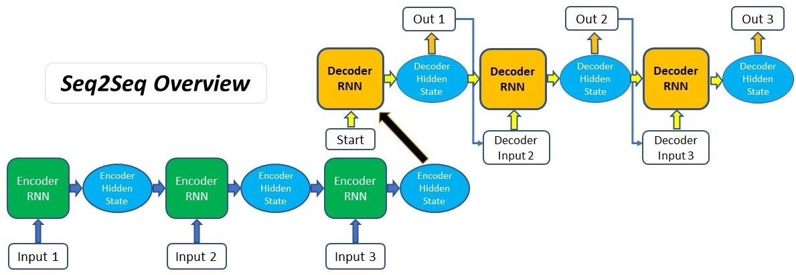

# Attention Model Mechanism

---

Imagine you're in a crowded room at a party, and there's a famous celebrity giving a speech. As the celebrity speaks, people in the audience may look at different parts of the room, focusing their attention on different moments of the speech. Similarly, the **Attention model** in neural networks allows the model to focus on different parts of the input sequence while processing each step. This is particularly useful for tasks where different parts of the input contribute differently to the output.

Few of the best example are: Image Captioning and Language Translation

In the above fig, you can observe how a Attention model is implemented in Image Captioning
### Benefits of Attention:

**Better Contextual Information**: In many tasks, certain parts of the input sequence are more relevant to predicting a specific part of the output sequence. Attention mechanisms allow the model to focus more on these relevant parts, capturing richer contextual information.

**Handling Long Sequences**: Traditional RNNs like LSTM or GRU tend to suffer from the vanishing gradient problem when processing long sequences, making it difficult for them to capture distant relationships between elements in the sequence. Attention helps alleviate this issue by allowing the model to "attend" to different parts of the input sequence directly, regardless of their temporal distance.

**Reduced Burden on Memory**: In RNNs, the hidden states need to encode all the relevant information from the past, which can be challenging when sequences are very long. Attention allows the model to selectively focus on relevant portions of the sequence, reducing the burden on the memory.

## Attention Sequence to Sequence models workflow

Assume we are building a Hindi to English translator:

Let's say you're translating the Hindi sentence:

- **"मैं खाना खा रहा हूँ"** into English:
- **"I am eating"**

Consider the sequence of the words in a sentence:

- **मैं खाना खा रहा हूँ**  
    
- x(1) x(2) x(3) x(4)x(5)

The translated sequence for the above sentence looks like:

- **I am eating**
- y(1) y(2) y(3)

Here x and y are the notation representation for the two sequence which is used to train the model

### Building blocks for Attention model

The **Encoder-Decoder** model is a sequence-to-sequence architecture that consists of two main components: an Encoder and a Decoder. The Encoder takes the input sequence (e.g., the Hindi sentence) and processes it into a fixed-size **context vector**, also known as the "thought vector" or "latent representation." This context vector aims to capture the essence of the input sequence. The Decoder then takes the context vector and generates the output sequence (e.g., the English translation) one element at a time, using the context vector and previously generated elements as inputs;

Let's simplify each step:

#### 1. Encoder:

The Encoder is like a language comprehension system. In our example, it takes the **Hindi sentence** as input and processes it word by word. For each word, it generates a hidden state that captures the word's meaning and its context within the sentence. The Encoder's role is crucial because it converts the input sentence into a form that the Decoder can understand and use.

#### 2. Decoder:

The Decoder is like a language generation system. It's responsible for producing the translated **English sentence** based on the information it receives. At the beginning of the translation, the Decoder is initialized with the final hidden state of the Encoder. It then starts generating words one by one. For instance, it might start with "I" based on the context from the Encoder's final state.

#### 3. Attention Mechanism:

Imagine you're translating a complex sentence. Certain words in the source sentence might have a stronger impact on determining the right translation for the current word you're generating. The Attention Mechanism is like your focus. It helps the Decoder pay more attention to specific parts of the source sentence at each step of translation. This mimics human reading behavior, where you focus on different parts of a sentence as you understand and translate it. In our example, the Attention Mechanism ensures that the Decoder can concentrate on the most relevant words in the Hindi sentence for generating each word in English.

#### 4. Context Vector

This is part that pays attention to the vector. The **Context Vector** is a summarized representation of the relevant parts of the source sentence, influenced by the Attention Mechanism. Think of it as a distilled version of the key information from the Hindi sentence that the Decoder needs to generate the next word. As the Decoder progresses, it uses this context vector along with its own internal state to predict the most appropriate word in English. In our example, the context vector might emphasize the word **"खाना"** when generating the English word **"eating"** to ensure accurate translation.

- #### **Note**: If you are keen to understand the advanced math behind Attention model and its implementation from scratch, please refer the advanced math section here: [Attention Maths Session](https://aiplanet.com/learn/llm-bootcamp/module-3/2336/attention-model-math-simplified).
    
- #### **Please note**: The advanced math is only recommed for advanced users who wants to dive deep into the Research side, if you are just looking for intuition and application, you can skip the advanced section and carry forward.
    

## Evolution of Attention model architecture

### 1: Encoder-Decoder Architecture

The basic Encoder-Decoder architecture is commonly used for sequence-to-sequence tasks like machine translation. It involves two main components:

- Encoder: This component takes the input sequence and encodes it into a fixed-size context vector or hidden state, which captures the input information.
- Decoder: This component generates the output sequence based on the context vector produced by the encoder.

**Example**: Machine Translation:

- Input (source language): "मैं खाना खा रहा हूँ"
- Output (target language): "I am eating"

In this example, the Encoder processes the source sentence "मैं खाना खा रहा हूँ" and creates a context vector. The Decoder then generates the target sentence "I am eating" based on this context vector.

### 2: Context for Every Input (Seq2Seq with Global Attention)

In the basic **Encoder-Decoder** architecture, the entire input sequence is encoded into a single context vector. However, this can be limiting for longer sequences or when specific parts of the input need more attention. The "Context for Every Input" approach addresses this limitation.

  

In this approach, the Decoder has access to the entire input sequence while generating each output word. The context vector is computed as a weighted sum of the encoder's hidden states, allowing the Decoder to pay attention to different parts of the input sequence for different output words.

**Example**: Machine Translation:

- Input: "मैं खाना खा रहा हूँ"
- Output: "I am eating"

Now, when translating "खाना" to "eating," the Decoder can focus more on the relevant part of the input sequence where "eating" is mentioned.

### Step 3: Attention Mechanism (Soft Attention)

The introduction of attention mechanisms further refines the **"Context for Every Input"** approach. Instead of relying solely on the context vector, the Decoder calculates **Attention scores** for each position in the input sequence. These attention scores determine the relevance of each input position to the current decoding step.

Mathematically, attention scores are calculated using a compatibility function (e.g., dot product or multiplicative attention) between the Decoder's hidden state and the Encoder's hidden states. The scores are then normalized to form **Attention weights**, which are used to compute the context vector as a weighted sum of the Encoder's hidden states.

When translating "खा रहा हूँ" to "am eating," the attention mechanism assigns higher weights to the words "am" and "eating" in the input sequence, indicating their importance for generating the phrase "I am eating." This allows the model to capture the correct tense and meaning during translation.

## Must watch

- #### Statquest video on Attention: [Attention for Neural Networks, Clearly Explained!](https://www.youtube.com/watch?v=PSs6nxngL6k)

## Related Notes

## References
