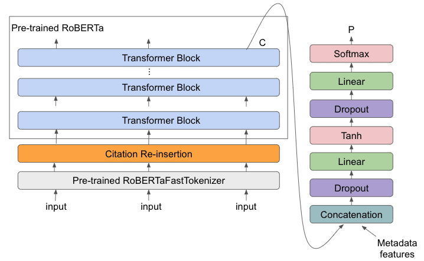
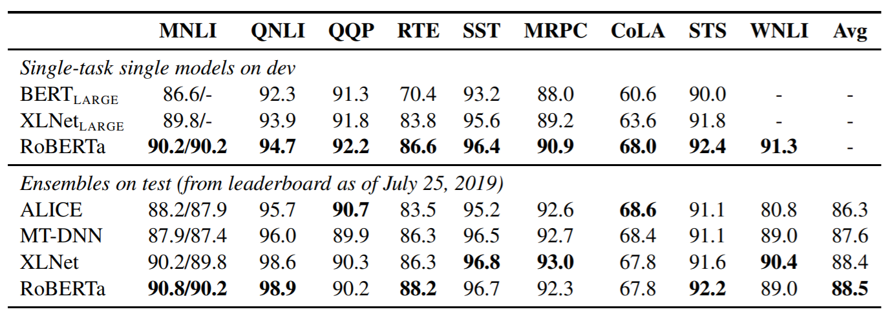

# Pre-trained transformers- BERT and RoBERTa

---

## BERT - Bidirectional Encoder Representations from Transformers

The BERT model was proposed in BERT: Pre-training of Deep Bidirectional Transformers for Language Understanding by Jacob Devlin, Ming-Wei Chang, Kenton Lee and Kristina Toutanova.  
  
**Abstract**  
  
We introduce a new language representation model called **BERT**, which stands for **Bidirectional Encoder Representations from Transformers**. Unlike recent language representation models, BERT is designed to pre-train deep bidirectional representations from unlabeled text by jointly conditioning on both left and right context in all layers. As a result, the pre-trained BERT model can be fine-tuned with just one additional output layer to create state-of-the-art models for a wide range of tasks, such as question answering and language inference, without substantial task-specific architecture modifications.  
  
BERT is conceptually simple and empirically powerful. It obtains new state-of-the-art results on eleven natural language processing tasks, including pushing the GLUE score to 80.5% (7.7% point absolute improvement), MultiNLI accuracy to 86.7% (4.6% absolute improvement), SQuAD v1.1 question answering Test F1 to 93.2 (1.5 point absolute improvement) and SQuAD v2.0 Test F1 to 83.1 (5.1 point absolute improvement).  

- **Paper**: **[ArXiv](https://arxiv.org/abs/1810.04805)**
- **Code**: **[GitHub](https://github.com/google-research/bert)**

### Why BERT?

Traditional language models, like LSTMs and GRUs, process text sequentially, which limits their understanding of context. They read words left to right or vice versa, missing the broader context and dependencies between words. BERT, however, breaks this limitation by being bidirectional – it considers both the left and right contexts of each word. This allows BERT to generalize well to new tasks and to perform better than traditional NLP models.

### How does BERT work?

BERT uses a transformer encoder architecture. A transformer encoder is a neural network that can learn long-range dependencies between words in a sentence. This is important for NLP tasks because the meaning of a word can often depend on the words that surround it.

**BERT is trained on two tasks**:

> - **Next sentence prediction**: BERT is given a pair of sentences and asked to predict whether the second sentence is the next sentence in the original document. This helps BERT learn to understand the relationships between sentences. It's like a language model trying to generate coherent text.
>     - Here's an example:
>         - Input: "The cat is on the"
>         - Target: "roof"
> 
> The model learns from a massive amount of text data that, given the context, the word "roof" is likely to follow "The cat is on the."

> - **Masked language modeling**: BERT is given a sentence with some of the words masked out. BERT is then asked to predict the missing words. This helps BERT learn the representations of individual words in context. Here a certain percentage of words in the input sentence are randomly replaced with a special token (usually [MASK]), and the model's objective is to predict the original words.
> 
> This task encourages the model to understand and generate contextually relevant words.
> 
> - Here's an example:
>     - Input: "The [MASK] is on the roof."
>         
>     - Target: "cat"
>         
> 
> In this case, the model needs to predict the word "cat" to make the sentence coherent and meaningful.

### BERT in a simplified way:

Let's say we want to train a BERT model to answer questions about text. We would first need to collect a large dataset of text and questions. Then, we would use this dataset to train the BERT model.  
  
The BERT model would first be trained on the next sentence prediction task. This would help the model learn to understand the relationships between sentences. Next, the BERT model would be trained on the masked language modeling task. This would help the model learn the representations of individual words in context.  
  
Once the BERT model is trained, it can be used to answer questions about text. To do this, we would simply give the BERT model a question and a piece of text. The BERT model would then use its knowledge of the relationships between words to answer the question.

## RoBERTa - Robustly Optimized BERT Pretraining Approach

RoBERTa, short for "A Robustly Optimized BERT Pretraining Approach," is an extension of the BERT model that aims to further improve its pretraining process. RoBERTa was introduced in the paper "RoBERTa: A Robustly Optimized BERT Pretraining Approach" by Yinhan Liu, Myle Ott, Naman Goyal, Jingfei Du, Mandar Joshi, Danqi Chen, Omer Levy, Mike Lewis, Luke Zettlemoyer, and Veselin Stoyanov.  
  
**Abstract**  
  
Language model pretraining has led to significant performance gains but careful comparison between different approaches is challenging. Training is computationally expensive, often done on private datasets of different sizes, and, as we will show, hyperparameter choices have significant impact on the final results. We present a replication study of BERT pretraining (Devlin et al., 2019) that carefully measures the impact of many key hyperparameters and training data size. We find that BERT was significantly undertrained, and can match or exceed the performance of every model published after it. Our best model achieves state-of-the-art results on GLUE, RACE and SQuAD. These results highlight the importance of previously overlooked design choices, and raise questions about the source of recently reported improvements. We release our models and code.

**Paper: [ArXiv](https://arxiv.org/abs/1907.11692)**

**Code: [GitHub](https://github.com/facebookresearch/fairseq/tree/main/examples/roberta)**

### Limitations of BERT

- BERT processes text in chunks due to memory limitations, which can lead to a lack of context for longer texts. It doesn't have a built-in memory mechanism to retain information from the beginning of a text when processing the end.
- Despite its bidirectional architecture, BERT's attention mechanism has a fixed context window. This means that it may struggle to capture very long-range dependencies or relationships between words that are farther apart in the text.
- BERT learns from large-scale text data, but it doesn't possess real-world knowledge or common sense reasoning abilities. It might struggle with tasks that require background knowledge or reasoning beyond the training data.
- While multilingual models based on BERT exist, they still face challenges in capturing nuances across languages, especially low-resource ones, due to the varying linguistic structures and expressions.

### Why RoBERTa?

RoBERTa aims to address some of the limitations and weaknesses identified in the original BERT model. While BERT introduced bidirectional context understanding and significantly improved performance across various NLP tasks, there were still areas that could be enhanced. RoBERTa, by refining the training process and scaling up the data and model, sought to achieve even better results.  
  
RoBERTa is trained on a dataset of 1.56TB of text, which is more than 10 times larger than the dataset that BERT was trained on. This larger dataset helps RoBERTa to learn more about the nuances of language and to make better predictions.  
  
RoBERTa uses a different masking procedure. RoBERTa uses a dynamic masking procedure, which means that the masked words are different for each training example. This helps RoBERTa to learn to predict words in a wider variety of contexts.

### How does RoBERTa work?

RoBERTa's architecture is based on BERT's transformer encoder model, but with modifications in the training approach. The key differences between BERT and RoBERTa include:

- **Dynamic Masking**: While BERT uses masked language modeling with a fixed masking pattern, RoBERTa employs dynamic masking. This means that the masking pattern changes from epoch to epoch during training. This encourages the model to generalize better by not relying on specific positions of words.
- **Larger Batch Size and More Data**: RoBERTa uses a larger batch size and more training data compared to BERT. This helps the model learn more robust representations and capture diverse language patterns.
- **No Next Sentence Prediction**: BERT trained on next sentence prediction to encourage understanding of sentence relationships. However, RoBERTa found that this task might introduce noise. Therefore, RoBERTa does not perform next sentence prediction during pretraining.
- **More Training Steps**: RoBERTa is trained for more iterations compared to BERT, allowing the model to see the data multiple times and refine its representations.

### When to use?

#### BERT:

- If you need a model that is state-of-the-art on a variety of NLP tasks.
- If you are fine-tuning the model for a specific task.
- If you have a large amount of training data available.

#### RoBERTa:

- If you need a model that is faster and uses less memory than BERT.
- If you are fine-tuning the model for a specific task and want to improve performance over BERT.
- If you do not have a large amount of training data available

**Here are some specific examples of how RoBERTa has improved over BERT**:

- On the **SQuAD(v1.1)** question answering benchmark, RoBERTa achieved a score of **93.6**, which is **2.6** points higher than the score achieved by BERT(**90.9**).
- On the **GLUE*** benchmark for natural language understanding, RoBERTa achieved an average score of **88.5**, which is higher than the score achieved by BERT.

Glue*: The General Language Understanding Evaluation (GLUE) benchmark (Wang et al.2019b) is a collection of 9 datasets for evaluating natural language understanding systems

## Reference:

- [Paper of Code](https://paperswithcode.com/)
- Research papers
    - [BERT](https://arxiv.org/pdf/1810.04805.pdf)
    - [RoBERTa](https://arxiv.org/pdf/1907.11692.pdf)

## Related Notes

## References
