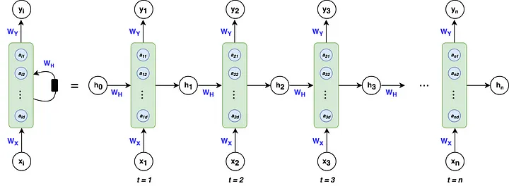
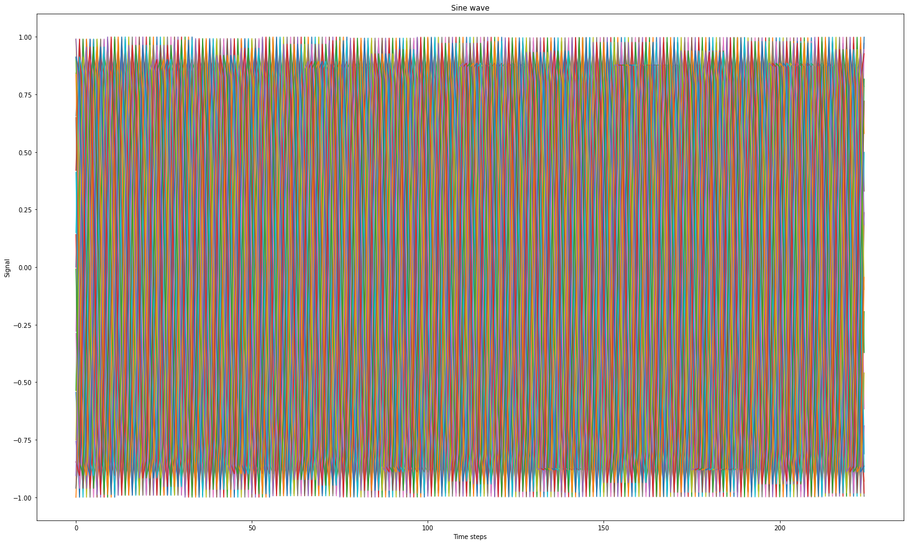
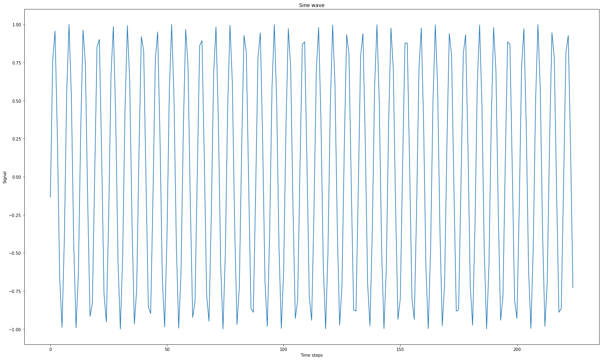
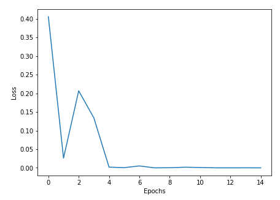
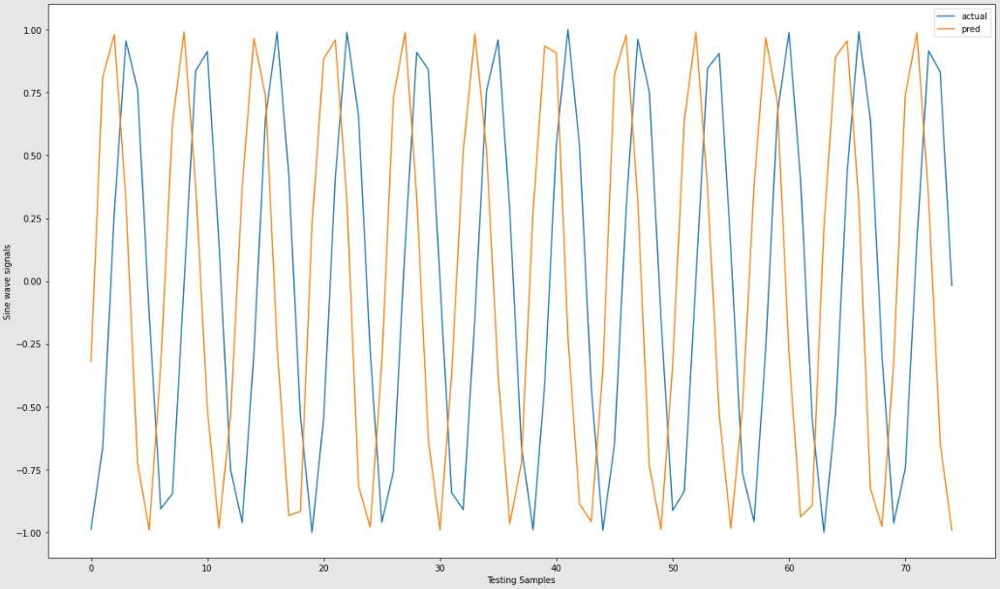

## **Understanding RNNs: Why Sequential Data Matters**

Imagine you're watching a movie and you pause it for a snack break. When you come back, you remember the plot, the characters, and what just happened. This ability to remember past events helps you make sense of the movie's storyline. Similarly, Recurrent Neural Networks (RNNs) are designed to "remember" the previous data in a sequence, which makes them perfect for tasks where order matters - like understanding language or predicting stock prices.  
  
**Why Choose RNNs Over Standard Neural Networks?**

1. **Fixed vs. Variable Length:**
    
    - **Standard Neural Networks:** Think of these like a recipe. For a cake, you always need a fixed number of ingredients (inputs) and you get a cake at the end (a fixed output). If you're trying to guess the price of a house based on features like its size and location, a standard neural network is great because you use a fixed number of inputs to get one output: the price.
    - **RNNs:** Now, imagine you're translating a whole book from English to Spanish. Some chapters are longer, some are shorter. Here, both the input (English text) and the output (Spanish translation) can be of different lengths. RNNs are flexible and can handle this.
2. **Remembering Past Information:**
    
    - **Standard Neural Networks:** These work like someone who forgets a story's beginning by the time they get to the end. They don't keep track of the sequence of data.
    - **RNNs:** Picture someone reading a book, keeping track of all the events. They remember the previous data and use that memory to make sense of the next piece of data.
3. **Context is King:** Let's play a quick game. Consider the sentence: "New York is amazing, and Emma loves it." Here, "New York" is a place, and "Emma" is a person. Now, why did you think that? It's because of the context and the position of words. Standard neural networks would just look at this sentence as a bag of words, but RNNs see the flow and order, helping them identify "New York" and "Emma" correctly.
    

In essence, while standard neural networks are great for some tasks, when it comes to understanding the sequence and context, RNNs are the way to go!


Source:[Towards AI](https://pub.towardsai.net/whirlwind-tour-of-rnns-a11effb7808f)

**Why RNNs are Special?**

1. **Adapting to Sequence Lengths:** Imagine trying to fit your varying shoe collection into boxes of the same size. Traditional feedforward networks are like those fixed-sized boxes. In contrast, RNNs are like stretchable bags that can adapt to fit any shoe size. This flexibility means they’re perfect for tasks where the data's length can change, like sentences that can be short or super long.
    
2. **Context Carriers:** Let's say you're watching a movie. If you skip a few minutes, you might miss a crucial plot twist. Just as you need memory of the earlier scenes to understand the next, RNNs remember past data points to comprehend the current one. This memory helps them see the connection between words and their significance in sentences.
    
3. **Sequential Masters:** Remember when you tried baking without following the recipe's order and ended up with a disaster? Sequence matters! RNNs are built to respect this order. They read data like we read stories - understanding what came before to make sense of what comes next.
    

**Choosing the Right Neural Network for the Task**

- **Pick Standard Neural Networks When:**
    
    - Sequence isn’t a priority. It’s like identifying fruits based on their colors. Whether you saw an apple or banana first doesn't change how you perceive the color of each.
- **Go for RNNs When:**
    
    - Sequence is king. For instance, understanding the storyline in a book or a song's lyrics where each word or event is influenced by the ones before it.

## RNN Math Simplified

> Note: If you are keen to understand the advanced math behind RNNs and its implementation from scratch, please refer the advanced math section here: **[RNN Maths Simplified](https://aiplanet.com/learn/llm-bootcamp/module-2/2332/rnn-maths-simplified)**.

> Please note: The advanced math is only recommed for advanced users who wants to dive deep into the research side, if you are just looking for intuition and application, you can skip the advanced section and carry forward.

## Different types of input-output mappings in RNNs


Source:[Andrej Karpathy blog](http://karpathy.github.io/2015/05/21/rnn-effectiveness/)

### Examples:

#### One to One: Time Series - Stock Market Analysis

In stock market analysis, you often deal with time series data, where the value at each time step depends on the previous values. RNNs are used to capture temporal dependencies and patterns in the data. Each time step's input is fed into the RNN, and it processes the sequence to predict future stock prices or trends based on historical data.

#### One to Many: Image Captioning and Music Generation

In image captioning, an RNN takes an image as input and generates a sequence of words that describe the content of the image. Similarly, in music generation, RNNs can take a seed note as input and generate a sequence of musical notes to create a melody. The RNN generates output step by step, where each output depends on the previous output, mimicking the structure of sentences in captions or the musical notes in a melody.

#### Many to One: Sentiment Analysis

Sentiment analysis involves determining the sentiment or emotion expressed in a piece of text. In this case, RNNs process a sequence of words in a sentence and produce a single output that represents the sentiment (positive, negative, neutral). The RNN captures the context and relationship between words to make an informed sentiment prediction.

#### Many to Many (Encoder + Decoder): Language Translation

For language translation, an RNN can be used as an Encoder-Decoder model. The encoder processes the input sentence in the source language, capturing its meaning and context into a fixed-size vector (context vector). The decoder then takes this context vector as input and generates the corresponding translation in the target language, one word at a time. RNNs in this setup enable the model to remember and use the context of the entire source sentence during translation.

#### Many to Many: Video Classification

In video classification, RNNs can be applied to sequences of video frames. The RNN processes each frame sequentially, capturing temporal information and relationships between frames. This helps in recognizing patterns or actions in videos over time. The final output could be a classification label indicating the content or action in the video.

## Vanishing Gradient or Exploding Gradient problems

- Training Recurrent Neural Network is hard and complex. During the backpropogation through time, the parameters are multiplied over and over again. The gradient will eventually be scalled up or down depending on the singlular value. If the value is greated than 1, the **Exploding gradient problem** is caused and if it’s less than 1, the **Vanishing gradient** problem.
- One reason possible reason to, remember as we discussed earlier: **"the deactivation value is passed to the next time step(iteration)."** If any time step value is lowered to zero, then the remaining time step value is influenced as well.
- Exploding gradients occurs in the rare case, as the parameters during training usually lower down. And when exploding gradient occurs, the time steps value is NaN i.e, the indication of overflowing. One solution to tackle Exploding gradient is to use Gradient clipping.

To tackle the Vanishing gradients, the three common approaches are:

- **Solution 1:** Activation Function
- **Solution 2:** Weights Intialization
- **Solution 3:** More complex gated cell: Introduction of LSTM and GRU cells

## LSTM for Langauge modelling


Source:[Medium story by Ottavio Calzone](https://medium.com/@ottaviocalzone/an-intuitive-explanation-of-lstm-a035eb6ab42c)

Imagine you're trying to predict the next word in a sentence. You're using the previous words to guess what comes next. Both LSTM and RNN are like language detectives, but they have different ways of investigating.

### RNN (Recurrent Neural Network):

RNN is like a detective who only has a short attention span. Every time they get a new word, they quickly forget the old ones. So, if the sentence is really long, the RNN detective might forget the context that matters.

#### For example:

- Input sentence: "The cat sat on the..."
- RNN's attention: "The cat sat on the... What?"

The RNN detective loses the context of "cat" and "sat" as it moves forward, and it struggles to remember long-term relationships in the sentence.

### LSTM (Long Short-Term Memory):

LSTM is like a super detective with an excellent memory. It pays attention to all the words in the sentence, remembers the important details, and ignores the less important ones.

#### For example:

- Input sentence: "The cat sat on the..."
- LSTM's attention: "The cat sat on the... Hmm, probably a mat."

The LSTM detective can remember that "cat" is likely to be followed by something related, like "mat," even if there are many words in between. It captures the context and relationships more effectively.

In this context, LSTM replaces RNN by addressing the short attention span problem. LSTMs have memory cells that can hold onto important information for a long time, making them better at understanding sequences with long-term dependencies. They're great for tasks where remembering context and relationships over time is crucial, like language translation, speech recognition, and predicting sequences.

## Code Implementation- RNN from Scratch

Please do checkout a overview on how to implement Simple Recurrent Neural Network using PyTorch
```python
import numpy as np 
import matplotlib.pyplot as plt
```


```python
X, y = [], [] 
total_size = 250 
time_steps = 25 
sin_wave = np.sin(np.arange(total_size)) 
for step in range(sin_wave.shape[0]-time_steps): 
	X.append(sin_wave[step:step+time_steps]) 
	y.append(sin_wave[step+time_steps])
```

```python
plt.figure(figsize=(25,15)) 
plt.plot(X) 
plt.xlabel("Time steps") 
plt.ylabel("Signal") 
plt.title("Sine wave")
```



```python
plt.figure(figsize=(25,15)) 
plt.plot(y) 
plt.xlabel("Time steps") 
plt.ylabel("Signal") 
plt.title("Sine wave")
```



```python
X = np.array(X).reshape(len(y),time_steps,1) 
X.shape
```

```
(225, 25, 1)
```

```python
y = np.array(y).reshape(len(y),1)
y.shape
```

```
(225, 1)
```

```python
class VanillaRNN:
    def __init__(self, input_size,hidden_size, output_size):
        self.input_size = input_size
        self.output_size = output_size
        self.hidden_size = hidden_size 
        self.Wx = np.random.randn(self.hidden_size, self.input_size.shape[2])
        self.Wh = np.random.randn(self.hidden_size, self.hidden_size)
        self.Wy = np.random.randn(self.output_size.shape[1],self.hidden_size)
    
    def activation(self, xt, ht_1):
        ht = np.tanh(np.dot(self.Wx,xt.reshape(1,1)) + np.dot(self.Wh,ht_1))
        yt = np.dot(self.Wy,ht)
        return ht, yt
    
    def forward(self, sample):
        sample_input, sample_output = self.input_size[sample], self.output_size[sample]
        #initial hidden state at h(0)
        ht = np.zeros((self.hidden_size,1)) # since h1 is the initial state make it zero
        self.hidden_states = [ht] 
        self.inputs = []
        for step in range(len(sample_input)):
            ht, yt = self.activation(sample_input[step],ht)
            self.inputs.append(sample_input[step].reshape(1,1))
            self.hidden_states.append(ht)

        self.error = yt - sample_output
        self.loss = 0.5*self.error**2
        self.yt = yt
        
    def backward(self):
        n = len(self.inputs)
        dyt = self.error 
        dWy = np.dot(dyt,self.hidden_states[-1].T)
        dht = np.dot(dyt, self.Wy).T
        dWx = np.zeros(self.Wx.shape)
        dWh = np.zeros(self.Wh.shape)
        
        for step in reversed(range(n)):
            temp = (1-self.hidden_states[step+1]**2) * dht 
            dWx += np.dot(temp, self.inputs[step].T)
            dWh += np.dot(temp, self.hidden_states[step].T) 
            dht = np.dot(self.Wh, temp)
            
        dWy = np.clip(dWy, -1, 1)
        dWx = np.clip(dWx, -1, 1)
        dWh = np.clip(dWh, -1, 1)
        self.Wy -= self.lr * dWy
        self.Wx -= self.lr * dWx
        self.Wh -= self.lr * dWh
    
    def training(self, epochs=10, learning_rate=1e-4):
        self.update = []
        self.lr = learning_rate
        for epoch in range(epochs):
            for sample in range(self.input_size.shape[0]):
                self.forward(sample)
                self.backward()
            self.update.append(np.squeeze(self.loss / self.input_size.shape[0]))
            self.loss = 0
            
    def testing(self,x,y):
        self.x = x
        self.y = y
        self.outputs = []
        for sample in range(len(x)):
            self.forward(sample)
            self.outputs.append(self.yt)
```

```python
hidden_size = 128
RNN = VanillaRNN(X,hidden_size,y)
```

```python
RNN.training(15,1e-2)
```

```python
X_test, y_test = [], []
total_size = 400
time_steps = 25
sin_wave = np.sin(np.arange(total_size))
for step in range(sin_wave.shape[0]-time_steps):
    X_test.append(sin_wave[step:step+time_steps])
    y_test.append(sin_wave[step+time_steps])
```

```python
X_sample,y_sample = X_test[300:],y_test[300:]
X_sample = np.array(X_sample).reshape(len(y_sample),time_steps,1)
y_sample = np.array(y_sample).reshape(len(y_sample),1)
```

```python
RNN.testing(X_sample, y_sample)
```

```python
pred = np.array(RNN.outputs).reshape(y_sample.shape)
```

```python
len(pred),len(X_sample)
```

```
(75, 75)
```

```python
len(RNN.update)
```

```
15
```

```python
plt.figure(figsize=(15,5))
plt.subplot(1,2,1)
plt.plot(RNN.update)
plt.xlabel("Epochs")
plt.ylabel("Loss")
```



```python
plt.figure(figsize=(20,12))
plt.plot(range(len(X_sample)),y_sample,label="actual")
plt.plot(range(len(X_sample)),pred,label="pred")
plt.xlabel("Testing Samples")
plt.ylabel("Sine wave signals")
plt.legend()
```




## Related Notes

## References
- **[Sequence Models- Course 5 from Deep Learning Specialization by DeepLearning.AI at Coursera](https://www.coursera.org/learn/nlp-sequence-models/)**