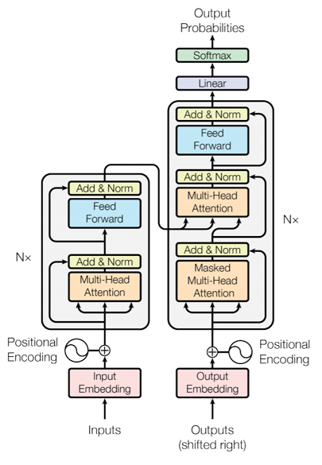
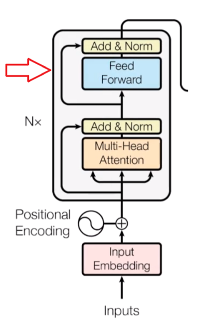
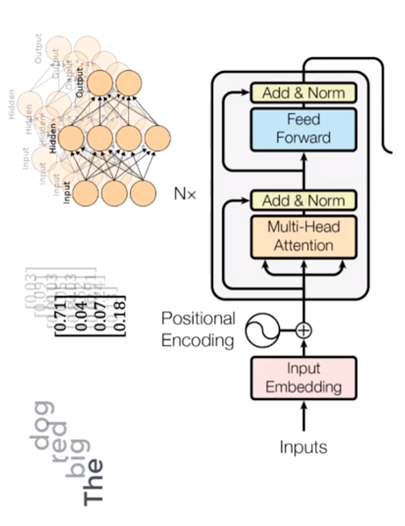
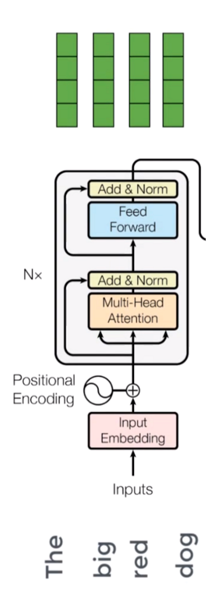
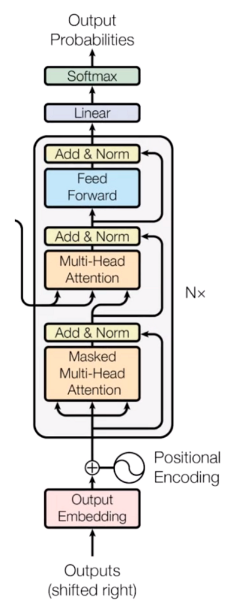
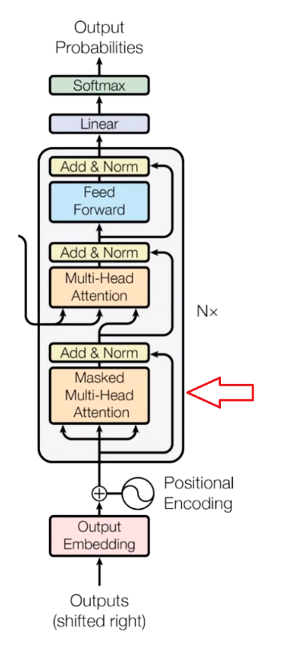
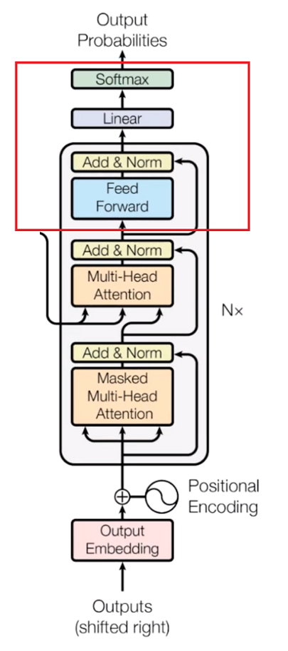

# Transformers- Attention is all you need

---

## Transformers Implementation

Imagine you've been refining your skills in understanding and implementing **Attention mechanisms** through Module 3. You're now ready to take your knowledge to the next level with Module 4, where we'll learn the revolutionary concept of **Transformers**. Just like how the attention mechanism enhanced the way neural networks process sequences, Transformers have taken this idea to an entirely new level, transforming the landscape of various natural language processing (NLP) and machine learning tasks.

#### Well, yes this is also Transformers, but in this module we will talk about Transformers in context of Deep Learning

Transformers are a type of neural network architecture that has gained immense popularity and has become the cornerstone of many state-of-the-art models across different domains. Developed by Vaswani et al. in the groundbreaking paper **"Attention Is All You Need** published in **2017**," Transformers address several limitations of traditional attention mechanisms and have demonstrated exceptional performance across a range of tasks, from language translation and image captioning to text generation and question answering.

  

One of the standout distinctions of the **Transformer**, in contrast to prior methods, is its ability to ingest an entire input sequence concurrently. This parallel processing feature enables a more effective use of GPUs, greatly accelerating training speeds.

  

Another defining feature of the Transformer is its **Multi-headed Attention mechanism**. This mechanism significantly alleviates the vanishing gradient problem, a pervasive issue in RNN, by dividing the attention into multiple parts, each focusing on different aspects of the input.

The primary context of this paper revolves around deploying the transformer architecture for **Neural Machine Translation (NMT)**.

By introducing the transformer, the paper provides solutions to two of the major challenges faced by the prior methodologies

### Limitations of Attention

- **Computational Complexity**: The traditional Attention mechanism involves pairwise comparisons between all elements in a sequence, resulting in a quadratic complexity with respect to sequence length. This complexity can quickly become overwhelming, especially when dealing with long sequences, making training and inference time-consuming and resource-intensive.
    
- **Global Dependencies**: While Attention is capable of capturing dependencies between distant elements in a sequence, it's often not very efficient at doing so. The mechanism relies on a weighted combination of all elements in the sequence, and as the sequence length increases, it becomes harder for the mechanism to assign meaningful weights, potentially leading to dilution of relevant information.
    
- **Positional Information**: Traditional Attention mechanisms treat all positions in a sequence equally. They lack inherent knowledge about the relative positions or order of elements. This can be problematic for tasks where the order of elements matters, such as language translation, where word order can differ significantly between languages.
    
- **Limited Context**: Attention mechanisms might struggle to capture long-range dependencies and intricate relationships within the sequence. Even though they can attend to different parts of the input sequence, their effectiveness diminishes as the temporal distance between elements increases, leading to difficulty in understanding complex contextual relationships.
    
- **Inability to Parallelize**: The nature of the sequential processing in Attention models limits parallelization during training. This contrasts with architectures like Transformers, which capitalize on parallel processing to significantly speed up training times.
    

## Building blocks of a Transformer

For a bit of perspective, if we were to examine a traditional RNN-based translator, we'd notice that sequences or sentences are fed into the model sequentially, one word following the other. This sequential processing is necessitated by the architecture: every word's representation is contingent on its predecessor, with the hidden state updating in sequence. The inherent dependency between words means the model must process them one at a time.

### Encoder Block

Computers don't interpret words like humans do. They operate on numerical data, such as numbers, vectors, or matrices. So, how do we translate our words into a format they can process?

  

This is where the idea of embedding spaces comes into the picture. Think of it as a vast lexical field or dictionary where semantically similar words cluster together. Within this space, every word is assigned a specific vector based on its semantic value, turning our words into numerical representations.

  

However, another challenge arises. In various contexts, a word can have multiple meanings. To address this, we employ positional encoders. These are vectors that offer context by marking the position of a word within a sentence.  
The process is: **Word → Embedding → Positional Encoding → Resultant Contextual Vector**.

  

With the input now prepared, it's fed into the **encoder** block.

### Positional Encoding: Infusing Sequence Order

Imagine you're building a machine translation system to convert English sentences to French. You're using a Transformer model, which is renowned for its ability to capture complex relationships between words.  
Let's look at a simple English sentence and see how the absence of positional encoding can lead to confusion:

  

**English Sentence: "I love eating apples."**

In English, word order plays a crucial role in determining the sentence's meaning. Without positional encoding, the Transformer might treat each word as an independent entity, unaware of their order. The attention mechanism alone might not be sufficient to convey the sentence's structure. Let's see what could happen:

  

- **Word Attention**: If the model focuses solely on word-level attention, it might capture the relationships between words but miss the context provided by their positions. The translation could end up like: "J'aime les pommes manger." (incorrect French translation)
- **Global Attention**: If the model uses global attention without positional information, it might produce something like: "Les pommes manger j'aime." (incorrect French translation)
- **Confused Syntax**: Without positional encoding, the model could confuse the order of words, leading to nonsensical translations like: "Manger j'aime les pommes." (incorrect French translation)

Now, let's consider the same English sentence with the addition of **Positional encoding**:

  

English Sentence: "I love eating apples."

  

Positional encoding provides the model with information about the word order within the sequence. It helps the model understand that "I" comes before "love," which comes before "eating," and so on. With this added information, the Transformer can better capture the sentence's structure and generate accurate translations:

**French Translation: "J'adore manger des pommes."**

In this case, the Transformer, equipped with positional encoding, correctly understands the word order and generates a fluent translation that preserves the original sentence's meaning.

### Multi-head attention

The core of a transformer lies on a critical component: Self-attention.

This mechanism evaluates the significance of a word in relation to other words within the same sentence, resulting in what's called an attention vector. For each word, an attention vector is formulated to encapsulate the contextual interplay among words in the sentence.

However, a challenge arises. Each word naturally assigns a higher weight to itself, overshadowing its relationship with other words in the sentence. To address this, we create several attention vectors for each word and compute a weighted average to derive the final attention vector for that word.

  

Given the use of multiple attention vectors, this method is termed the **Multi-head attention** block.

### Feed-forward Network

The second phase involves using a **feed-forward neural network**. Each attention vector undergoes a straightforward feed-forward neural network transformation to make it suitable for the subsequent encoder or decoder layer.

The feed-forward network processes attention vectors individually. Notably, in contrast to RNNs, these attention vectors are not dependent on each other. This independence allows for parallel processing, which significantly enhances efficiency.

We can now input all the words concurrently into the encoder block and obtain the corresponding encoded vectors for each word in parallel.

### Decoder

When training a translator from English to French, we provide an English sentence and its corresponding French translation for the model to understand and learn. The English sentences are processed by the encoder block, while the French ones go through the decoder block.

Initially, there's the embedding layer and positional encoder component that convert words into their corresponding vectors. This process mirrors what we observed in the encoder section.

### Masked Multi-head Attention

The process now moves to the self-attention block, where attention vectors are created for each word in the French sentences. These vectors showcase how each French word relates to every other word within the same sentence, mirroring the mechanism we noted in the encoder.

  

However, this block has a distinct title: the **masked multi-head attention** block. Let's break it down simply.

  

To understand this, it's crucial first to grasp the learning mechanism. When an English word is input, the system attempts to translate it into French based on previous knowledge. This predicted translation is then compared with the actual French translation we provided to the decoder. Following this comparison, the system adjusts its internal values. After numerous iterations, the system refines its translation capabilities.

  

A pivotal aspect to note is the necessity to mask or hide the subsequent French word during the initial prediction phase. If the system already knows the upcoming French word, its prediction becomes moot. The genuine learning occurs when the system tries to predict the next word without having prior knowledge of it.

In terms of data flow, while any word from the English sentence can be considered, for the French sentence, only the preceding word is used for the learning process. Therefore, when executing matrix operations in parallel, it's crucial to ensure that words appearing later in the sequence are masked (transformed into zeros). This prevents the attention mechanism from accessing them.

The attention vectors produced in the previous step, along with the vectors from the encoder block, are then channeled into another multi-head attention block. This is the juncture where the encoder's outputs are integrated, which is visually represented in the diagram. This integration is why this particular block is termed the **encoder-decoder attention** block.

  

Given that there's a vector for every word in both the English and French sentences, the role of this block is pivotal. It maps English words to their French counterparts, establishing the relationship between them. Essentially, this stage forms the core of the English to French word translation process.

  

The culmination of this block's operations yields attention vectors for each word in both the English and French sentences. Importantly, each of these vectors encapsulates the interrelation of words across the two languages.

Next, when we channel each attention vector through a feed-forward unit, the output vectors are transformed into a format that can be readily processed by another decoder block or a linear layer. This linear layer is essentially another **feed-forward layer**, designed to expand the dimensions to accommodate the number of potential words in the translated French sentence.

  

Following this transformation, the vectors undergo processing via a softmax layer. The softmax layer's primary function is to convert its input into a probability distribution. This makes the output both understandable and interpretable for humans. Consequently, after this transformation, the word with the highest probability is selected as the final translated word.

## References:

- Image credits- Research paper "Attention is all you need": [https://arxiv.org/abs/1706.03762](https://arxiv.org/abs/1706.03762)

## Further Reading

- Blog article: [https://mchromiak.github.io/articles/2017/Sep/12/Transformer-Attention-is-all-you-need](https://mchromiak.github.io/articles/2017/Sep/12/Transformer-Attention-is-all-you-need/#.XIWlzBNKjOR)
- Blog article: [https://towardsdatascience.com/transformers-141e32e69591](https://towardsdatascience.com/transformers-141e32e69591)

## Related Notes

## References
